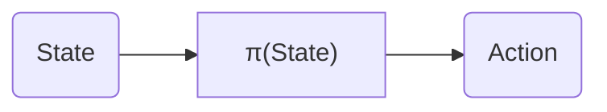
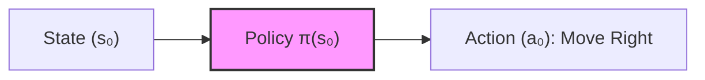
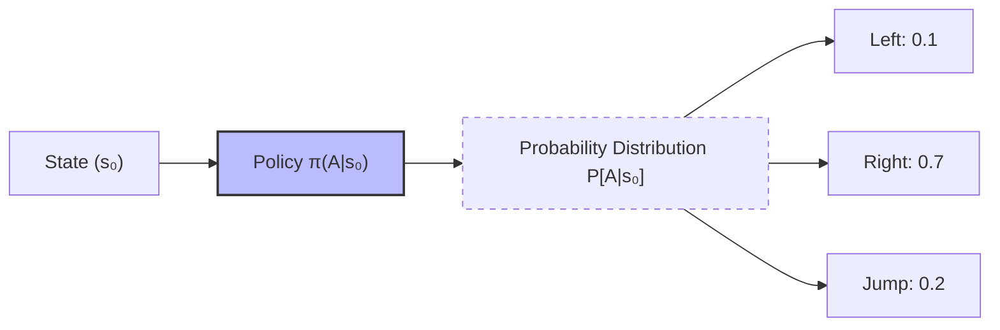
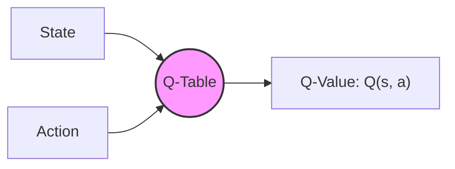
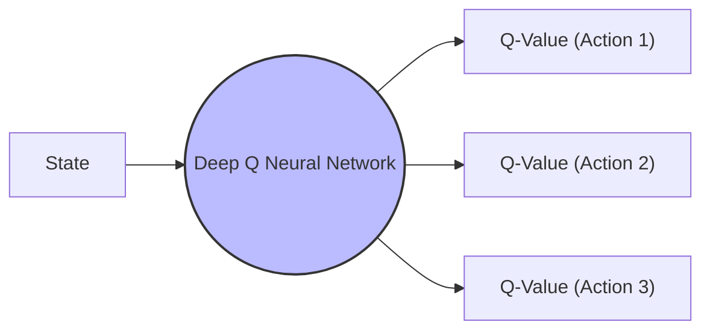

# Unit 1: Introduction to Deep Reinforcement Learning

## 1.1 Introduction

Deep Reinforcement Learning (Deep RL) is a subfield of machine learning where an **agent** learns to make decisions by performing **actions** in an **environment** to maximize a **reward**.

* **The Goal:** Learn an optimal strategy (Policy) to get the most rewards over time.
* **Hands-on:** In this unit, we train a `LunarLander-v2` agent using the **Stable Baselines3** library.

## 1.2 What is RL?

>Reinforcement learning is a framework for solving control tasks (also called decision problems) by building agents that learn from the environment by interacting with it through trial and error and receiving rewards (positive or negative) as unique feedback.

* **The Analogy:** Like a child learning to play a video game. They press buttons (actions), see the score increase (reward) or lose a life (punishment), and adjust their behavior accordingly.
* **Reward Hypothesis:** All goals can be described as the ***maximization of the expected return (expected cumulative reward).***
  > That’s why in Reinforcement Learning, ***to have the best behavior,*** we aim to learn to take actions that **maximize the expected cumulative reward.**

## 1.3 The RL Framework

The RL process is a loop that happens at each time step :

1. **State ($S_t$):** The agent receives the current state from the environment.
2. **Action ($A_t$):** The agent takes an action based on that state.
3. **Reward ($R_{t+1}$):** The environment gives a reward.
4. **Next State ($S_{t+1}$):** The environment transitions to a new state.

### Key Concepts:

* **Markov Property:** The agent only needs the current state to decide the next action; the history of past states and actions is irrelevant.
  > _The future is independent of the past given the present."_
  > _The memoryless property of a stochastic process, which means that its future evolution is independent of its history._

* **Observations vs. States:** Observations/States are the information our agent gets from the environment.
  - **State, $s$:** A complete description of the state of the world. No hidden information. (e.g., Chess, complete board view).
  - **Observation, $o$:** A partial description of the state of the world. In a partially observed environment (e.g., Super Mario where you only see the current screen).
    
_Note: In this course, we use the term "state" to denote both state and observation, but we will make the distinction in implementations._

* **Action Space:** The Action space is the set of all possible actions in an environment.
  - **Discrete:** Finite number of possible actions (Up, Down, Left, Right).
  - **Continuous:** Infinite number of possible actions (Steering wheel angle from -180° to 180°).

* **Rewards and Discounting:**

  - The reward is ***the only feedback*** for the agent. It lets our agent know ***if the action taken was good or not.*** The cumulative reward at each time step $t$ can be written as:
      > $$G_t = R_{t+1} + R_{t+2} + R_{t+3} + ...$$
  - However, in reality, rewards that come sooner are more likely to happen and more predictable than long-term future rewards. We use **discounting** to account for this.
  - Each reward is discounted by gamma to the exponent of the time step:
      > $$G_t = \sum_{k=0}^{\infty} \gamma^k R_{t+k+1}$$
  - This means as the time step increases (the further into the future the reward is), the less it contributes to the immediate decision.

* **The Discount Rate ($\gamma$):** We define a discount rate called **gamma ()**. It must be between 0 and 1 (typically 0.95 to 0.99).
  - **Larger $\gamma$ (closer to 1):** Smaller discount; the agent cares more about long-term rewards.
  - **Smaller $\gamma$ (closer to 0):** Larger discount; the agent cares more about short-term rewards (the "nearest cheese to the mouse").

## 1.4 Tasks: Episodic vs. Continuing

A task is an ***instance*** of a Reinforcement Learning problem. We can have two types of tasks: episodic and continuing.
* **Episodic Tasks:** Have a clear starting and ending point ***(a terminal state). This creates an episode:*** a list of States, Actions, rewards and new States (e.g., a game of Pong).
* **Continuing Tasks:** Tasks that continue forever without a terminal state (e.g., automated stock trading). In this case, the agent must ***learn how to choose the best actions and simultaneously interact with the environment.***

## 1.5 The Exploration/Exploitation Trade-off

* **Exploration:** Trying random actions to find more information about the environment (a mouse searching for a bigger cheese [+1000] rather than the nearest one [+1]).
* **Exploitation:** Using known information to maximize rewards (eating the small cheese right in front of you).
* **The Challenge:** Finding the right balance so the agent doesn't get stuck in "local optima."
* **Example: Choosing a Restaurant**
  - <u>Exploitation:</u> You go to the same one that you know is good every day and take the risk to miss another better restaurant.
  - <u>Exploration:</u> Try restaurants you never went to before, with the risk of having a bad experience but the probable opportunity of a fantastic experience.

## 1.6 Two Main Approaches
Now that we have learned the RL framework, how do we solve the RL problem? In other words, how do we build an RL agent that can select the actions that maximize its expected cumulative reward?

### The Policy : The Agent's Brain

The **Policy $\pi$** is the brain of our Agent. It is the function that tells us what action to take given the state we are in. It defines ***the agent's behavior*** at a given time.

* **Goal:** The function we want to learn is the **optimal policy $\pi^*$**, which is the policy that ***maximizes the expected return*** when the agent acts according to it. We find this $\pi^*$ ***through training.*** There are two main approaches to training our agent to find this optimal policy:

1. **Policy-Based Methods:** Directly teach the agent which ***action to take,*** given the current state.
2. **Value-Based Methods:** Indirectly teach the agent ***which state is more valuable*** and then take the action that ***leads to the most valuable states.***

   
> To maximize the expected return, we must find the **Optimal Policy ($\pi^*$)**.

### Approach A: Policy-Based Methods
The agent learns a policy function directly. The policy is the "brain" that maps states to actions (or probabilities of actions).
- **Deterministic Policy:** Always returns the same action for a specific state ($a = \pi(s)$ ).
  

- **Stochastic Policy:** Returns a probability distribution over actions ($\pi(a|s) = P[A = a|S = s]$).
  

### Approach B: Value-Based Methods
The agent learns a **Value Function,** ($V(s)$ or $Q(s,a)$ ) instead of a policy, that maps a state to the expected return. The policy then becomes: ***"Take the action that leads to the state with the highest value."***
$`v_{\pi}(s) = \mathbb{E}_{\pi} [R_{t+1} + \gamma R_{t+2} + \gamma^2 R_{t+3} + \dots | S_t = s]`$

- **Goal:** Map each state to the expected value of being in that state.
- **Decision Making:** The agent doesn't "know" which action is best; it simply looks at the surrounding states and moves toward the one with the highest value ($V(s)$ or $Q(s,a)$ ).

### Reinforcement Learning: Comparison of Approaches

| Feature | Policy-Based Methods | Value-Based Methods |
| :--- | :--- | :--- |
| **What is learned?** | The Policy ($\pi(s)$ ) | The Value Function ($V(s)$ or $Q(s,a)$ ) |
| **Output** | Best Action (or probability distribution) | Value/Score of a State or Action |
| **Logic** | "In this state, do this." | "This state is worth $X$ points." |
| **Action Selection** | The policy directly outputs the action. | The agent chooses actions leading to the highest value states. |
| **Example Algorithms** | Policy Gradients (e.g., PPO, REINFORCE) | Q-Learning, Deep Q-Networks (DQN) |

## 1.7 The "Deep" in Deep RL

* **Classic RL:** Uses a "lookup table" (Q-Table) to store values for every possible state and action. This doesn't scale to complex games with billions of states. Q-Learning is shown below:

* **Deep RL:** Uses **Deep Neural Networks,** hence the name “deep,” as function approximators to predict the best action or value without needing a table. Deep Q-Learning is shown below:
  

In the next unit, we'll learn about two value-based algorithms: **Q-Learning** (classic Reinforcement Learning) and then **Deep Q-Learning**.

You'll see the difference is that:

* In the **first approach (Q-Learning)**, we use a traditional algorithm to create a **Q table** that helps us find what action to take for each state.
* In the **second approach (Deep Q-Learning)**, we will use a **Neural Network** (to approximate the Q value).

| Feature | Classic Reinforcement Learning | Deep Reinforcement Learning |
| :--- | :--- | :--- |
| **Technology** | Uses traditional algorithms and data structures (like Q-Tables). | Uses Deep Neural Networks (CNNs, RNNs, Transformers, etc.). |
| **Scalability** | Good for environments with small state spaces. | Necessary for complex environments with large or continuous state spaces (like video games or robotics). |
| **Feature Engineering** | Hand-crafted features often required. | Neural networks automatically learn features from raw input (like pixels). |

## 1.8 Summary
### Short version
* RL is a loop of **State $\rightarrow$ Action $\rightarrow$ Reward $\rightarrow$ Next State.**
* The objective is to maximize the **Expected Return** (discounted cumulative reward).
* We use **Discounting ($\gamma$)** because immediate rewards are more certain than distant future rewards.
* We can find the **optimal policy $\pi^*$** by policy-based methods or value-based methods.
* Deep RL introduces **deep neural networks to estimate the Q-value.**

### Long Version
#### 1. What is Reinforcement Learning?

Reinforcement Learning (RL) is a **computational approach of learning from actions**. We build an **agent** that learns from the **environment** by interacting with it through trial and error and receiving **rewards** (negative or positive) as feedback.

#### 2. The Goal

The goal of any RL agent is to **maximize its expected cumulative reward** (also called **expected return**). This is based on the **Reward Hypothesis**: the idea that all goals can be described as the maximization of the expected cumulative reward.

#### 3. The RL Process

The RL process is a loop that outputs a sequence of:
**State  Action  Reward  Next State**

#### 4. Discounting

To calculate the expected return, we **discount the rewards**. Rewards that come sooner are more probable to happen and more predictable than long-term future rewards, so they are weighted more heavily.

#### 5. Policies: The Agent's Brain

To solve an RL problem, we want to find an **optimal policy ()**. The policy is the "brain" of the agent—it tells us what action to take given a state. The optimal policy is the one that results in the maximum expected return.

#### 6. Two Ways to Find the Optimal Policy

* **Policy-Based Methods:** Training the policy directly to learn which action to take in a given state.
* **Value-Based Methods:** Training a **value function** to learn which state is more valuable and using that information to define a policy (usually "go to the state with the highest value").

#### 7. Why "Deep" RL?

We speak about **Deep Reinforcement Learning** because we introduce **deep neural networks** to:

* Estimate the action to take (Policy-based).
* Estimate the value of a state (Value-based).

## 1.9 Glossary

### Short Version
* **Agent:** The AI learner/decision maker.
* **Environment:** The world the agent lives in.
* **Policy ($\pi$):** The "brain" of the agent—the strategy it follows.
* **Value Function:** Tells us how "good" it is for the agent to be in a certain state.
* **Gamma ($\gamma$):** The discount rate (usually between 0.95 and 0.99).

### Long Version
#### **Agent**

An agent learns to **make decisions by trial and error, receiving rewards and punishments from its surroundings.**

#### **Environment**

An environment is a simulated world **where an agent can learn by interacting with it.**

#### **Markov Property**

The principle that the action taken by our agent is **conditional solely on the present state and is independent of all past states and actions.**

#### **Observations / State**

* **State:** A complete description of the state of the world.
* **Observation:** A partial description of the state of the environment/world.

#### **Actions**

* **Discrete Actions:** A finite number of actions, such as Left, Right, Up, and Down.
* **Continuous Actions:** An infinite possibility of actions (e.g., in the case of self-driving cars, the driving scenario has an infinite possibility of actions occurring.).

#### **Rewards and Discounting**

* **Rewards:** The fundamental feedback factor in RL. It tells the agent whether an action was good or bad.
* RL algorithms are focused on maximizing the **cumulative reward.**
* **Reward Hypothesis:** The idea that all RL problems can be formulated as the maximization of (cumulative) return.
* **Discounting:** The process of weighting immediate rewards more heavily than future (long-term) rewards because they are more predictable and certain.

#### **Tasks**

* **Episodic:** Tasks that have a clear starting point and an ending point (a terminal state).
* **Continuous:** Tasks that have a starting point but no ending point.

#### **Exploration vs. Exploitation Trade-Off**

* **Exploration:** Trying random actions to discover more about the environment and find potential rewards.
* **Exploitation:** Using existing knowledge of the environment to take actions that yield the maximum known rewards.
* **Trade-Off:** The balance required to decide how much to explore vs. how much to exploit known information.

#### **Policy**

* **Policy ():** Often called the "agent's brain." It is a function that tells the agent what action to take, given the current state.
* **Optimal Policy ():** The specific policy that **maximizes the expected return** when an agent acts according to it. It is learned through _training._

#### **Policy-Based Methods**

An approach where the policy is learned directly. It maps each state to the best corresponding action at that state or a probability distribution over the set of possible actions at that state.

#### **Value-Based Methods**

An approach where, instead of training a policy, we train a **value function** that maps each state to the expected value of being in that state.

---

##  Introduction to Deep Reinforcement Learning | Deep RL Course
This video covers the foundational concepts of the RL loop, the reward hypothesis, markov property, exploration/exploitation tradeofff, policy, and the difference between policy-based and value-based methods mentioned in my notes.  
*Click the image below to watch the Unit 1 Introduction*

