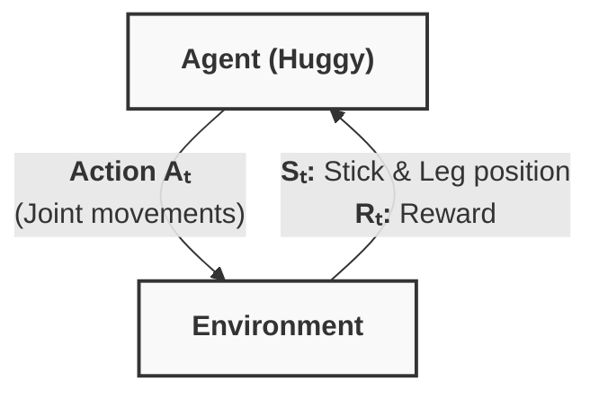
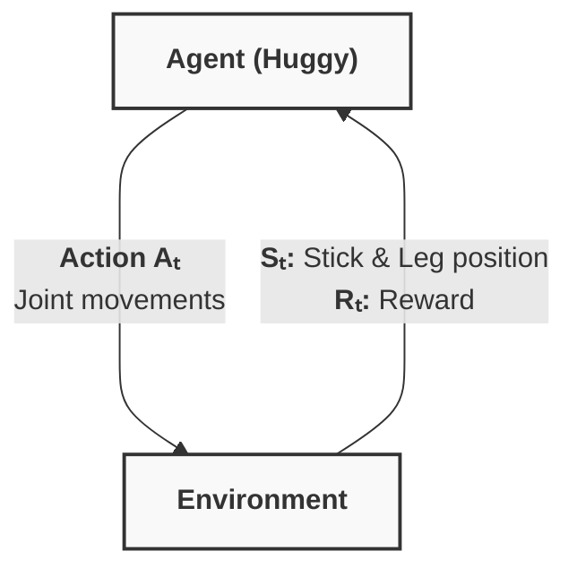
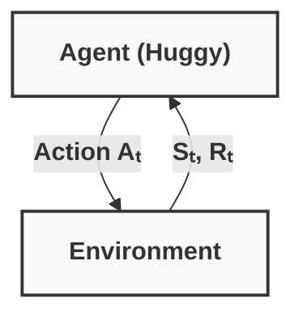

# Bonus Unit 1: Intro to Deep RL with Huggy 

In this bonus unit, we work with **Huggy the Dog**, an environment created in **Unity.** Unlike the simple grids of FrozenLake, this is a 3D environment where we train a dog to fetch a stick using **Deep Reinforcement Learning**.

## 1 Introduction

The goal of this unit is to see Deep RL in a more "lifelike" setting.

* **The Agent:** Huggy the Dog.
* **The Task:** Fetch the stick and bring it back to the target.
* **The Tool:** We use **Unity ML-Agents**, a toolkit that allows us to use Unity environments as RL gyms.


## 2 How Huggy Works

Huggy is a Deep Reinforcement Learning environment made by Hugging Face and based on Puppo the Corgi, a project by the Unity MLAgents team. This environment was created using the Unity game engine and MLAgents. 
ML-Agents is a toolkit for the game engine from Unity that allows us to create environments using Unity or use pre-made environments to train our agents.
In this environment, we aim to train Huggy to **fetch the stick we throw. This means he needs to move correctly toward the stick.**

Huggy isn't just a 3D model; he is a complex RL agent with specific inputs and outputs. 

### The Observation Space (What Huggy "perceives")

Huggy doesn't see "pixels." Instead, he receives a **Vector Observation** (a list of numbers that are information about the environment):

1. **Target Position:** Where the stick/target is located.
2. **Relative Position:** Where Huggy is in relation to the target.
3. **Orientation of His Legs:** The current rotation of his legs and body parts.

With all this information, Huggy can _use his policy to determine which action to take next to fulfill his goal._

### The Action Space (What Huggy "does")

Huggy uses a **Continuous Action Space**.
* Instead of "Left" or "Right," the brain outputs numbers (floats) that represent **Torque (force)** applied to his leg joints.
* Joint motors drive Huggy’s legs. This means that to get the target, Huggy needs to ***learn to rotate the joint motors of each of his legs correctly so he can move.***
* *Learning to walk/run is the first sub-task the agent implicitly solves.*

### The Reward Function (Motivation)
The goal is that Huggy moves towards the stick without spinning too much.

* **Positive Reward:** Getting closer to the stick.
* **Positive Reward:** Touching the stick.
* **Negative Reward:** Spinning too much and turning too quickly.
* **Negative Reward:** Time penalty-> a fixed-time penalty given at every action to force him to get to the stick as fast as possible.


## 3 Training Huggy

Huggy aims to ***learn to run correctly and as fast as possible toward the goal.*** To do that, at every step and given the environment observation, 
he needs to decide how to rotate each joint motor of his legs to move correctly (not spinning too much) and towards the goal. 
Because Huggy has a complex continuous action space, we use **PPO (Proximal Policy Optimization)**.

### The Training Process:

1. **The Brain:** We use a Neural Network that takes the vector observations and outputs joint forces.
2. **The Environment:** Unlike `gym`, Unity ML-Agents can run multiple "clones" of the environment simultaneously to speed up data collection.
3. **Hyperparameters:**
* **Batch Size:** How many experiences are used for one update.
* **Learning Rate:** How fast the "brain" changes its mind.
* **Time Horizon:** How many steps the agent looks forward to calculate rewards.

### The Training Loop








## 4 Play and Share

Once training is finished, the model is exported as a `.nn` or `.onnx` file.

* **The Play Loop:** The model is loaded into the Unity executable, and Huggy now "knows" how to run toward the stick based on the weights learned during training.
* **The Hub:** You can upload your Huggy model to the Hugging Face Hub just like you did with LunarLander.

---

### Recommended Repository Update

I suggest adding a "Practices" section to your `units/` folder to keep things clean.

```text
huggingface-deep-rl-study/
├── units/
│   ├── unit1-intro-rl/
│   ├── unit2-q-learning/
│   └── unit-bonus1-huggy/  <-- Add this!
│       ├── 01-intro-to-DeepRL-with-huggy.md
│       └── huggy_ppo_config.yaml  <- For your hyperparameters

```

### Quick Tip for Huggy

This unit uses a **Unity WebGL** demo to let you play with your trained agent in the browser. When you finish training, make sure to grab your **Model ID** (e.g., `Chiz/ppo-Huggy`) so you can load your personal dog in the [Huggy Playable Demo](https://huggingface.co/spaces/ThomasSimonini/Huggy).

